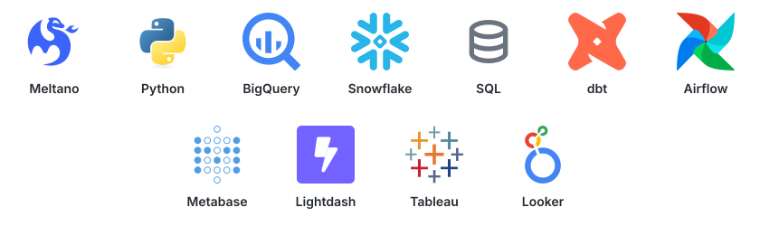

<h1 align="left">Hi, I'm Nico 👋</h1>

  

## Tech stack

  

- 💻 Analytics Engineer focused on modern data products, analytics platforms, and automation
- 🛠️ Working with **dbt, BigQuery, Snowflake, Airflow, Python, SQL, Lightdash, and Metabase**
- 🧩 Experience across data modeling, orchestration, pipelines, reporting, and analytics product development
- 🛢️ Developing [Barrilito / Vaca Muerta Pulse](https://github.com/nrohland/vaca-muerta-pulse), an open-data product for Argentina's energy sector
- 🤖 Exploring **AI-native analytics, semantic layers, and agentic data workflows**
- 📫 Reach me at **nicolas.rohland@gmail.com**
